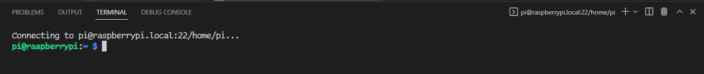
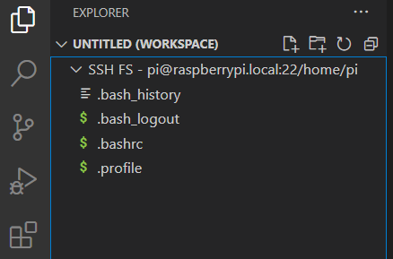
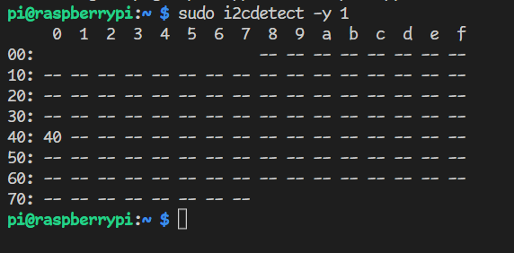

# Embedded Systems Lab
## Coursework 1, Part 1
### Rasberry Pi, Python and I²C

> **Warning**
> 
>  Do not try to power up the Raspberry Pi until you have followed these instructions in order.
>  It won’t do anything at all until it has been configured properly and you could damage it.
>  Rasberry Pi's do fail due to mishandling and there are no spares.

### 1. Check kit contents

Your coursework kit should contain the following items:
- Rasberry Pi Zero WH
- FTDI TTL-234X-3V3 USB-UART cable
- Breadboard
- Raspberry Pi breakout PCB
- microSD card and USB adapter
- Si7021 temperature sensor
- Wire and wire strippers

### 2. Set up Raspbian OS

> **Note**
> 
> This guide requires you to enter commands in different places
> 
> `raspberrypi:~$ command` is a command for the Linux prompt on the Pi
> 
> `host:~$ command` is a command for the Linux or macOS prompt on your laptop
> 
> `>>> command` is a command for the Python interpreter on the PI

1. Download and install Raspberry Pi Imager to your computer from here: https://www.raspberrypi.org/software/
2. Connect the microSD card to your computer. Use the USB adapter if your computer doesn’t have a microSD socket.
3. Run Raspberry Pi Imager. It requires admin privileges because it needs to rewrite the file system on the microSD card.
   1. Select the operating system Raspberry Pi OS Lite (32-bit). It’s under Raspberry Pi OS (other) in the list of options.
   2. Select the SD Card. Be careful – you could erase your data if you choose the wrong card.
   3. Open the advanced options menu with the cog icon. Make the following changes:
      1. Check 'Set hostname'. Change the hostname to something that is likely to be unique, for example by appending your College username.
      2. Check 'Enable SSH'
      3. Check 'Set username and password'
      4. Enter a password. Leave the username as `pi`
      5. (Optional) Configure a wireless network, which is only possible for WPA2-PSK networks (e.g. home WiFi, mobile hotspot) at this stage. See later instructions for WPA2-Enterprise (e.g. Imperial College)

   4. Select ‘WRITE’ to download and write the operating system image.
4. You need to enable the serial console to enter commands on the Raspberry Pi. This is done by editing the options that are passed to the Linux kernel when it boots up. You need to make this edit on the microSD card now because you have no other way to log in to the Raspberry Pi.
   1. The image you have written contains a partition called ‘boot’, which you should be able to access as a removable drive through the file system of your computer. Remove and reinsert the microSD card if you can’t find it.
   2. Open the file config.txt with a text editor and add the following to the end (after `[all]`) in a new line: `enable_uart=1`
   3.	Save the file.
5.	Unmount (eject) the microSD card. Remove it from your computer and insert it into the Raspberry Pi.
6.	Connect the Raspberry Pi:
    1. Connect the breakout PCB to the Raspberry Pi 
    2. Connect the USB-UART cable to the breakout PCB in the correct orientation
    3. Connect the power link to power up the Raspberry Pi. This supplies power from the USB-UART cable. 

> **Warning**
> 
> Take care with connections to the Raspberry Pi header.
> The USB cable provides 5V and the Raspberry Pi I/O pins can only tolerate 3.3V.
> Always check the positioning and orientation of the breakout board and USB-UART connector before connecting the power link.

> **Note**
> 
> You can also supply power to the ‘PWR IN’ connector on the Raspberry Pi with a USB power supply.
> Leave the power link from the USB-UART cable disconnected if you do this — the serial terminal will still work.

### 3. Establish communication with your Raspberry Pi (Serial)

> **Note**
>
> You may be able to skip to [step 5](https://github.com/edstott/ES-CW1/edit/main/lab-part-1.md#4-set-up-a-python-development-flow) if you configured a wireless network in the image options and it works right away.

1. Connect your FTDI USB to Serial cable to your laptop and find the port name. Don’t connect the cable to the Raspberry Pi yet
   1. In Windows:
      1. Open Device Manager and look under ‘Ports’ for an entry like ‘USB Serial Port (COMn)’
      2.	The port name is the part COMn
   2. In MAC or Linux:
      1.	Open a command prompt and list the available serial devices with `host:~$ ls /dev/{tty,cu}.*`
      2.	Try the command with and without the cable connected and look for a line which only appears when it is connected. That is the name of your serial port.
   3. If the system does not recognise the USB device, install the serial port driver from here: https://www.ftdichip.com/Drivers/VCP.htm
2. Open a terminal over the serial port:
    1. In Windows, install a terminal client like PuTTY
       1. Check the box ‘Serial’
       2. Enter the serial port name under ‘Serial Line’
       3. Set the speed to 115200
       4. Click 'Open'
    2. In MAC or Linux, you can use screen from the command line. For example, if `/dev/ttyS0` is the serial port:

```host:~$ screen /dev/ttyS0 115200```

4. Log in to the Raspberry Pi
    1. If the Raspberry Pi has finished booting the serial terminal will be blank. Press enter to refresh the login prompt. The first boot will take a while because the SD Card file system is resized to fill the card. The green activity LED will flicker during boot.
    3. Log in with the username `pi` and the password you specified in Raspberry Pi Imager.

> **Note**
> 
> The terminal client on your laptop connects to a chip inside the UART cable, which converts USB to UART. You don't need to reopen or reconnect the terminal if you reboot or power cycle the Raspberry Pi, as long as you leave the cable plugged in to your computer

### 4. Establish communication with your Raspberry Pi (WiFi)

1. Open the serial port terminal and log in to the Raspberry Pi
2. To connect to a WPA2-Enterprise network like Imperial College:
   1. Create a hash of your College password so it can’t be easily read from the SD Card. Replace `ppp` with your password in the command below. The hash is a 32 digit hexadecimal number. You can also use web tools to calculate an MD4 hash, if you trust them with your password. You may need to [preceed certain non-alphanumeric characters in your password with a forward slash](https://www.oreilly.com/library/view/learning-the-bash/1565923472/ch01s09.html).

      ```bash
      raspberrypi:~$ echo -n ppp | iconv -t utf16le | openssl md4
      ```
      
   3. Clear the command history to remove your password from it. Make sure you close the serial console when you are finished so it can’t be read by scrolling back: 

      ```bash
      raspberrypi:~$ history -c
      ```

   5. Edit the wpa_supplicant file to add the network details:

      ```bash
      raspberrypi:~$ sudo nano /etc/wpa_supplicant/wpa_supplicant.conf
      ```
      
   6. Add the following lines to the end of the file, replacing `uuu` with your username and `ppp` with password hash you just calculated. Save the file with Ctrl+o and exit with Ctrl+x.

        ```
        network={
           ssid="Imperial-WPA"
           scan_ssid=1
           key_mgmt=WPA-EAP
           identity="uuu"
           password=hash:ppp
           eap=PEAP
           phase1="peaplabel=0"
           phase2="auth=MSCHAPV2"
        }
        ```

   6. Restart the Pi: `raspberrypi:~$ sudo reboot`


2. To connect to WiFi with WPA2-PSK networks like home WiFi or mobile hotspot:
    1. Run the Raspberry Pi configuration tool: `raspberrypi:~$ sudo raspi-config`
    2. Use the arrow keys and enter to select ‘System Options’, then ‘Wireless LAN’
    3. Enter the SSID and password of your WiFi network when prompted

3. Test the connection:

    ```
    raspberrypi:~$ ping google.com
    ```

> **Note**
> 
> You can add mutliple networks to `wpa_supplicant.conf` and the Rapsberry Pi will connect to whichever is strongest. Networks added using `raspi-config` will also appear in the configuration file.

### 5. Set up a Python development flow
Follow the instructions according to the model of Raspberry Pi in your kit. Other tools for remote Python development are available and there is no requirement to follow the instructions here.

#### a. Original Raspberry Pi Zero

Visual Studio Code [does not support Raspberry Pi Zero with its remote development extension](https://github.com/microsoft/vscode-remote-release/issues/669#issuecomment-640986010). That means, among other things, that the debugger is not available. An alternative development flow is described here using a third-party extension, but other tools for remote Python development are available and you may wish to experiment to find a method that works well for you.

1. Install Microsoft Visual Studio Code on your laptop if you don't have it. Add the extensions for [Python](https://marketplace.visualstudio.com/items?itemName=ms-python.python) and [SSH FS](https://marketplace.visualstudio.com/items?itemName=Kelvin.vscode-sshfs)
2. Open a SSH terminal to the Raspberry Pi
   1. Type or select 'SSH FS: Open remote SSH terminal' in the Visual Studio Code Command Palette (F1)
   2. You should be able to connect to the Raspberry Pi using mDNS. Recall the hostname that you specified in Raspberry Pi Imager, including the `.local` suffix that was hardcoded in the interface. The default was `raspberrypi.local`.
   4. Type `pi@raspberrypi.local:22/home/pi`, changing the Raspberry Pi hostname as appropriate. The terminal will open at the bottom of the window.

   3. If the mDNS connection fails, use the serial terminal to find your Pi's IP address with `raspberrypi:~$ hostname -I`. Use this to open your SSH connection instead of the hostname. mDNS doesn't seem to work on the College WiFi.


2. Add the Raspberry Pi file system to your Workspace in Visual Studio Code
   1. Open the Command Palette and type/select 'SSH FS: Add as a Workspace folder'
   2. Type/select the same SSH URI as you used to open the terminal
   3. Enter the password if requested. Look out for additional password prompts at the top of the screen.
   4. Check that you can access the home directory on the Raspberry Pi in the Explorer sidebar


3. Create a Python script file
   1. Select File→New File...
   2. Enter the filename `main.py`
   3. Accept the complete path `/home/pi/main.py`
   4. Enter and save a test script:

        ```python
        print("Hello")
        ```
        
   5. Run the script on the Raspberry Pi using the SSH terminal:

      ```bash
      raspberrypi:~$ python3 main.py
      ```

#### b. Raspberry Pi Zero 2 or Raspberry Pi 3

1. Install Microsoft Visual Studio Code. Open a window and ensure sure that [Remote Development](https://marketplace.visualstudio.com/items?itemName=ms-vscode-remote.vscode-remote-extensionpack) is installed and enabled.
2. Open a Remote Window
   1. Click the remote development button in the bottom left-hand corner: 
   2.  A menu appears below the Search Bar/Command Palette at the top of the window. `Select Connect to Host...`, then 'Add New SSH Host'. 
   2. You should be able to connect to the Raspberry Pi using mDNS. Recall the hostname that you specified in Raspberry Pi Imager, including the `.local` suffix that was hardcoded in the interface. The default was `raspberrypi.local`. Type `pi@raspberrypi.local:22/home/pi`, changing the Raspberry Pi hostname as appropriate.
   3. If the mDNS connection fails, use the serial terminal to find your Pi's IP address with `raspberrypi:~$ hostname -I`. Use this to open your SSH connection instead of the hostname. mDNS doesn't seem to work on the College WiFi.
   4. Follow the instructions in the command bar. You will need to enter your password and specify the operating system of the remote device (Linux). Visual Studio Code will install some runtime components onto the Raspberry Pi.
3. Create a Python script file
   1. Select File→New File...
   2. Enter the filename `main.py`
   3. Accept the complete path `/home/pi/main.py`
   4. Enter and save a test script:

        ```python
        print("Hello")
        ```
        
   5. Run the script on the Raspberry Pi by using 'Debug Current File' in the 'Run and Debug' sidebar. You will see the result in the output window at the bottom of the window.

   >**Note**
   >
   >You should be able to connect to the Raspberry Pi from any computer on the same local network, depending on the structure of the network. In general, you won’t be able to reach it via the internet.
   >
   >The IP address is likely to change if you restart or reconnect the Raspberry Pi. You may be able to use a static IP if you have control over your DHCP server, but you can’t on the College network.


### 6. Establish communication with a sensor

The lab kit contains a Si7021 temperature/humidity sensor module to get started with I²C.

1. Power down the Raspberry Pi:
   1. Shut down the operating system. This reduces the chance of file corruption and it should be done before any power down: `raspberrypi:~$ sudo halt`
   2. Remove the power link
2. Plug the Raspberry Pi breakout adapter and sensor module into different locations on the breadboard
3. Consult the [product webpage for the sensor module](https://www.adafruit.com/product/3251) to find the appropriate supply voltage.
   Always use 3.3V in preference to 5V where available to reduce the chance of accidentally breaking the Raspberry Pi.
   Add wires between the module and the Raspberry Pi breakout:
   | RPi | Si7021 |
   | --- | ------ |
   | GND | GND    |
   | 3.3V or 5V (check) | VIN |
   | SDA | SDA |
   | SCL | SCL |
   
   I2C pullup resistors are not required because they are included on the Raspberry Pi.
4. Power the Raspberry Pi again and log in via SSH
5. Install the I2C tools package:

   ```bash
   raspberrypi:~$ sudo apt-get update
   raspberrypi:~$ sudo apt-get install i2c-tools
   ```

7. Enable I2C (Interface Options) `raspberrypi:~$ sudo raspi-config` and reboot `raspberrypi:~$ sudo reboot`
8. Search the I2C bus for your sensor module: `raspberrypi:~$ sudo i2cdetect -y 1`

   

   >**Note**
   >
   >The `i2cdetect` command shows a map of all the I2C addresses.
   >
   >You should see an entry at the address you expect from reading the sensor documentation.
   >Technically speaking, the I2C address is a 7-bit number but some datasheets append the read/write flag as the LSB to give two 8-bit addresses: one for reading and one for writing.
   >
   >Note that some devices have an address that is configurable by making connections to certain pins.

4. Install `pip`, the python package manager, and the `smbus2` and `gpiozero` Python modules

   ```bash
   raspberrypi:~$ sudo apt-get install python3-pip
   raspberrypi:~$ sudo pip3 install smbus2 gpiozero
   ```

5. Consult the [Si7021 datasheet](https://www.silabs.com/documents/public/data-sheets/Si7021-A20.pdf) to find the following information:
   - The I²C bus address (page 18)
   - The command byte to read temperature in 'no hold master mode' (page 18)
   - The conversion formula between the sensor output and degrees Celsius (page 22)

7. Use functions of the `smbus2` library to communicate with your sensor in main.py:
   
   ```python
   import time
   import smbus2
   
   si7021_ADD = #Add the I2C bus address for the sensor here
   si7021_READ_TEMPERATURE = #Add the command to read temperature here
   
   bus = smbus2.SMBus(1)
   
   #Set up a write transaction that sends the command to measure temperature
   cmd_meas_temp = smbus2.i2c_msg.write(si7021_ADD,[si7021_READ_TEMPERATURE])
   
   #Set up a read transaction that reads two bytes of data
   read_result = smbus2.i2c_msg.read(si7021_ADD,2)
   
   #Execute the two transactions with a small delay between them
   bus.i2c_rdwr(cmd_meas_temp)
   time.sleep(0.1)
   bus.i2c_rdwr(read_result)

   #convert the result to an int
   temperature = int.from_bytes(read_result.buf[0]+read_result.buf[1],'big')
   print(temperature)
   ```

   Add the constants for the I²C bus address and read temperature command. Run the script and, if all is well, you will see the temperature measurement.
   The measurement is the raw 16-bit word from the sensor and it is not yet scaled to real-world units.
   Nevertheless, you will see the number increase if you warm the sensor slightly and repeat the measurement.
   Add a statement to apply the conversion formula from the datasheet so that the script gives the measurement in degrees Celsius.
   
   >**Note**
   >
   >The use of the `time.sleep()` function may seem a little unsatisfactory.
   >The Si7021 sensor, like many, requires some time to perform the measurment after receiving the measurement command.
   >It is possible for the sensor to pause the I²C read transaction until the measurement has finished ('hold master mode' in the datasheet), but it uses an I²C feature called clock stretching, which is not supported by the Raspberry Pi (it actually implements a derivation of I²C called SMBus).
   >The workaround for this sensor is to wait long enough to guarantee that the measurement has finished before attempting the read transaction.
   


