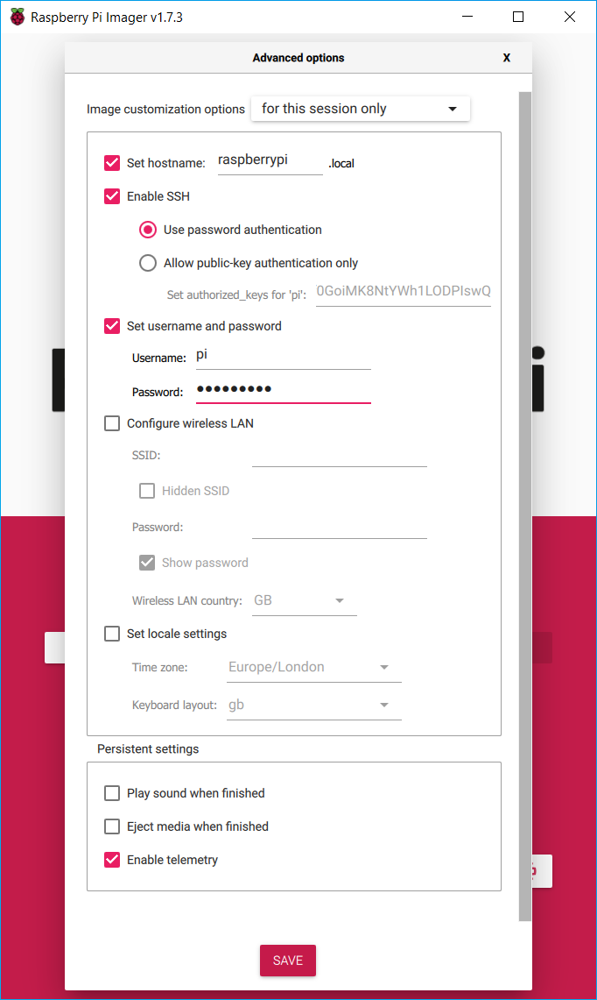
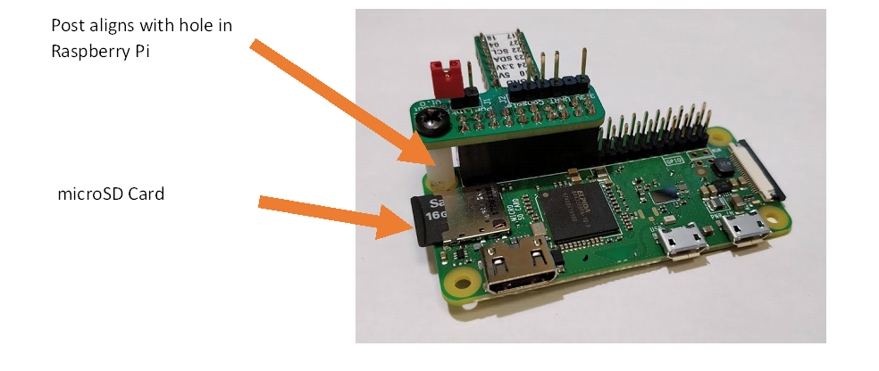
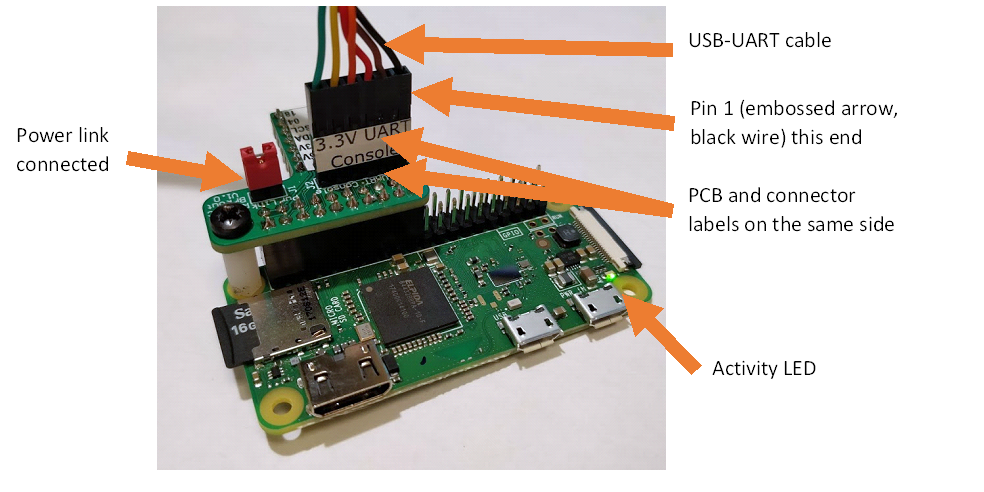

# Embedded Systems Lab
## Coursework 1, Part 1
### Rasberry Pi, Python and I²C

> **Warning**
> 
>  Do not try to power up the Raspberry Pi until you have followed these instructions in order.
>  It won’t do anything at all until it has been configured properly and you could damage it.
>  Rasberry Pi's do fail due to mishandling and there are no spares.

### 1. Check kit contents

Your coursework kit should contain the following items:
- Rasberry Pi Zero WH
- FTDI TTL-234X-3V3 USB-UART cable
- Breadboard
- Raspberry Pi breakout PCB
- microSD card and USB adapter
- Sensor kit
- Wire and wire strippers

### 2. Set up Raspbian OS

> **Note**
> 
> This guide requires you to enter commands in different places
> 
> `raspberrypi:~$ command` is a command for the Linux prompt on the Pi
> 
> `host:~$ command` is a command for the Linux or macOS prompt on your laptop
> 
> `>>> command` is a command for the Python interpreter on the PI

1. Download and install Raspberry Pi Imager to your computer from here: https://www.raspberrypi.org/software/
2. Connect the microSD card to your computer. Use the USB adapter if your computer doesn’t have a microSD socket.
3. Run Raspberry Pi Imager. It requires admin privileges because it needs to rewrite the file system on the microSD card.
   1. Select the operating system Raspberry Pi OS Lite (32-bit). It’s under Raspberry Pi OS (other) in the list of options.
   2. Select the SD Card. Be careful – you could erase your data if you choose the wrong card.
   3. Open the advnaced options menu with the cog icon. Make the following changes:
      1. Check 'Set hostname'. Change the hostname to something that is likely to be unique.
      2. Check 'Enable SSH'
      3. Check 'Set username and password'
      4. Enter a password. Leave the username as `pi`
      5. (Optional) Configure a wireless network, which is only possible for WPA2-PSK networks (e.g. home WiFi, mobile hotspot) at this stage. See later instructions for WPA2-Enterprise (e.g. Imperial College)

   4. Select ‘WRITE’ to download and write the operating system image.
4. You need to enable the serial console to enter commands on the Raspberry Pi. This is done by editing the options that are passed to the Linux kernel when it boots up. You need to make this edit on the microSD card now because you have no other way to log in to the Raspberry Pi.
   1. The image you have written contains a partition called ‘boot’, which you should be able to access as a removable drive through the file system of your computer. Remove and reinsert the microSD card if you can’t find it.
   2. Open the file config.txt with a text editor and add the following to the end in a new line: `enable_uart=1`
   3.	Save the file.
5.	Unmount (eject) the microSD card. Remove it from your computer and insert it into the Raspberry Pi.
6.	Connect the Raspberry Pi:
    1. Connect the breakout PCB to the Raspberry Pi 
    2. Connect the USB-UART cable to the breakout PCB in the correct orientation
    3. Connect the power link to power up the Raspberry Pi. This supplies power from the USB-UART cable. 

> **Warning**
> 
> Take care with connections to the Raspberry Pi header.
> The USB cable provides 5V and the Raspberry Pi I/O pins can only tolerate 3.3V.
> Always check the positioning and orientation of the breakout board and USB-UART connector before connecting the power link.

> **Note**
> 
> You can also supply power to the ‘PWR IN’ connector on the Raspberry Pi with a USB power supply.
> Leave the power link from the USB-UART cable disconnected if you do this — the serial terminal will still work.

### 3. Establish communication with your Raspberry Pi (Serial)

> **Note**
>
> You may be able to skip this step if you configured a wireless network in the image options.

1. Connect your FTDI USB to Serial cable to your laptop and find the port name. Don’t connect the cable to the Raspberry Pi yet
   1. In Windows:
      1. Open Device Manager and look under ‘Ports’ for an entry like ‘USB Serial Port (COMn)’
      2.	The port name is the part COMn
   2. In MAC or Linux:
      1.	Open a command prompt and list the available serial devices with `host:~$ ls /dev/{tty,cu}.*`
      2.	Try the command with and without the cable connected and look for a line which only appears when it is connected. That is the name of your serial port.
   3. If the system does not recognise the USB device, install the serial port driver from here: https://www.ftdichip.com/Drivers/VCP.htm
2. Open a terminal over the serial port:
    1. In Windows, install a terminal client like PuTTY
       1. Check the box ‘Serial’
       2. Enter the serial port name under ‘Serial Line’
       3. Set the speed to 115200
       4. Click 'Open'
    2. In MAC or Linux, you can use screen from the command line. For example, if `/dev/ttyS0` is the serial port:

```host:~$ screen /dev/ttyS0 115200```

4. Log in to the Raspberry Pi
    1. If the Raspberry Pi has finished booting the serial terminal will be blank. Press enter to refresh the login prompt. The first boot will take a while because the SD Card file system is resized to fill the card. The green activity LED will flicker during boot.
    3. Log in with the username `pi` and the password you specified in Raspberry Pi Imager.

### 3. Establish communication with your Raspberry Pi (WiFi)

1. To connect to a WPA2-Enterprise network like Imperial College:
   1. Open the serial port terminal
   2. Create a hash of your College password so it can’t be easily read from the SD Card. Replace `ppp` with your password in the command below. The hash is a 32 digit hexadecimal number.

      `raspberrypi:~$ echo -n ppp | iconv -t utf16le | openssl md4`
      
   3. Clear the command history to remove your password from it. Make sure you close the serial console when you are finished so it can’t be read by scrolling back: ```raspberrypi:~$ history -c```
   4. Edit the wpa_supplicant file to add the network details:

      `raspberrypi:~$ sudo nano /etc/wpa_supplicant/wpa_supplicant.conf`
      
   4. Add the following lines to the end of the file, replacing `uuu` with your username and `ppp` with password hash you just calculated. Save the file with Ctrl+o and exit with Ctrl+x.

```
network={
  ssid="Imperial-WPA"
  scan_ssid=1
  key_mgmt=WPA-EAP
  identity="uuu"
  password=hash:ppp
  eap=PEAP
  phase1="peaplabel=0"
  phase2="auth=MSCHAPV2"
}
```
   5. Restart the Pi: `raspberrypi:~$ sudo reboot`

2. Connect to WiFi with WPA2-PSK networks like home WiFi or mobile hotspot
    1. Run the Raspberry Pi configuration tool: `raspberrypi:~$ sudo raspi-config`
    2. Use the arrow keys and enter to select ‘System Options’, then ‘Wireless LAN’
    3. Enter the SSID and password of your WiFi network when prompted

3. Open a SSH connection
   1. You should be able to connect to the Raspberry Pi using mDNS. Recall the hostname that you specified in Raspberry Pi Imager, including the `.local` suffix that was hardcoded in the interface. The default was `raspberrypi.local`.
   1. (Windows) Install PuTTY or other SSH client (e.g. MobaXterm) if necessary. Open a new SSH session with your Pi's hostname.
   2. (Mac, Linux or Windows with openSSH installed) Use the command line (example hostname shown): `host:~$ ssh pi@raspberrypi.local`
   3. If the mDNS connection fails, use the serial terminal to find your Pi's IP address with `raspberrypi:~$ hostname -I`. Use this to open your SSH connection instead of the hostname.
   5. Check you have a network connection: `raspberrypi:~$ ping google.com`

>**Note**
>
>You should be able to connect to the Raspberry Pi from any computer on the same local network, depending on the structure of the network. In general, you won’t be able to reach it via the internet.
>
>The IP address is likely to change if you restart or reconnect the Raspberry Pi. You may be able to use a static IP if you have control over your DHCP server, but you can’t on the College network.

### 5. Establish communication with a sensor

Choose an I2C sensor from the selection available. It doesn’t need to be one you will use in your coursework.

- What does it do?
- What is the power supply voltage? If it uses a breakout module then check documentation for the module
- Research the communication interface for the sensor
  - What is its I2C bus address?
  - Does it need enabling or configuring before sensing is active?
  - Does it measure automatically or in response to a command?
  - How do you request a measurement (if applicable)?
  - How do you read back the result?
  - What conversion is needed to convert the result into something meaningful?

1. Power down the Raspberry Pi:
   1. Shut down the operating system. This reduces the chance of file corruption and it should be done before any power down: `raspberrypi:~$ sudo halt`
   2. Remove the power link
2. Plug the Raspberry Pi breakout adapter and sensor module into different locations on the breadboard
3. Wire up the sensor module
   1.	Check the documentation for the sensor module (the breakout, not the chip itself) to find the power requirements.
   2.	Use 3.3V if possible to reduce the chance of damage
   3. Wire up the positive and GND power supply connections between the sensor and the breakout adapter
   4. Wire up the I2C data and clock lines (SDA and SCL). I2C pullup resistors are not required because they are included on the Raspberry Pi.
4. Power the Raspberry Pi again and log in via serial or SSH
5. Install the I2C tools package: `raspberrypi:~$ sudo apt-get install i2c-tools`
6. Enable I2C (Interface Options) `raspberrypi:~$ sudo raspi-config` and reboot `raspberrypi:~$ sudo reboot`
7. Search the I2C bus for your sensor module: `raspberrypi:~$ sudo i2cdetect -y 1`

>**Note**
>
>The `i2cdetect` command shows a map of all the I2C addresses.
>
>You should see an entry at the address you expect from reading the sensor documentation.
>Technically speaking, the I2C address is a 7-bit number but some datasheets append the read/write flag as the LSB to give two 8-bit addresses: one for reading and one for writing.
>
>Note that some devices have an address that is configurable by making connections to certain pins.

### 6. Set up a Python development flow

1. *Connect to the Rasberry Pi via Visual Studio Code*
2. Install `pip`, the python package manager, and the `smbus2` and `gpiozero` modules

```
raspberrypi:~$ sudo apt-get install python3-pip
raspberrypi:~$ sudo pip3 install smbus2 gpiozero
```

4. Use functions of the `smbus2` library to communicate with your sensor
*Add examples from lecture notes*

